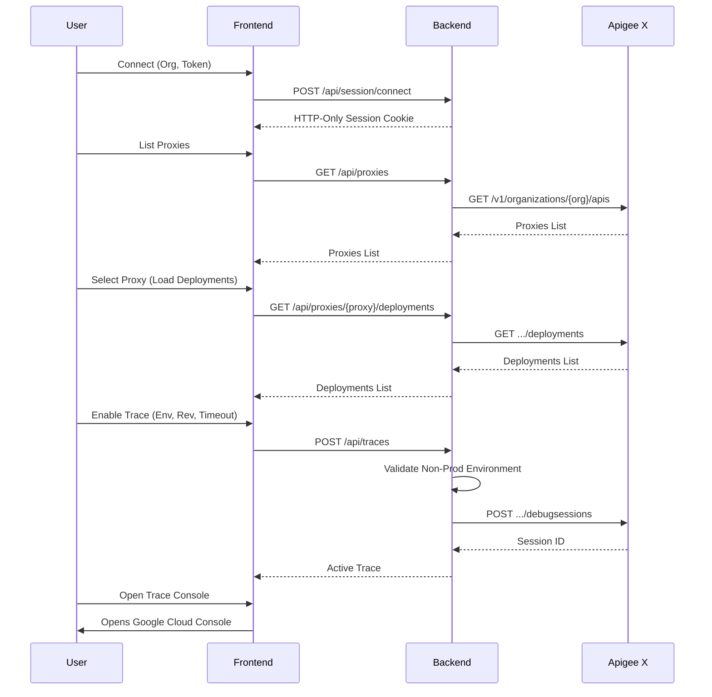

# Apigee X Trace Manager

Production-quality internal web application for managing Apigee X debug/trace sessions in non-production environments.

## Features

- **Connect securely**: Input Apigee Organization and a short-lived OAuth 2.0 access token.
- **Proxy & Deployment Discovery**: Read the API proxies and determine which environments they are truly deployed in.
- **Strictly Non-Prod**: Configurable blocked environments (e.g., prod, production) ensures tracing is never accidentally run on production proxies.
- **Trace Renewals**: Auto-renewal background worker in Node.js creates sequential sessions without modifying the original ones.
- **Console Link**: Direct jump to the Google Cloud Apigee Debug console using constructed URLs.
- **Token Security**: Tokens are held in an in-memory session map mapped to an HTTP-only secure cookie, never persisting in local storage or database.

## Local Setup

Ensure you have Node.js 22+ installed.

1. Install dependencies
```bash
npm install
```

2. Start the development server
```bash
npm run dev
```
The app will run on `http://localhost:3000`.

## Building for Production

```bash
npm run build
npm start
```
This bundles the backend via esbuild and the frontend via Vite, resulting in a standalone runnable file.

## Docker Deployment

To deploy this standalone app to a container environment (like vessel, Cloud Run, etc.):

```bash
docker-compose up -d --build
```

## Environment Variables

See `.env.example`. Key configuration options include:

- `BLOCKED_ENVIRONMENTS`: Comma-separated list of blocked prod environments.
- `MAX_TRACE_TIMEOUT_SECONDS`: Maximum seconds allowed for a single trace.
- `SESSION_TTL_MINUTES`: How long the local backend session holds the Apigee OAuth token.

## Required Permissions

The provided Google Cloud OAuth 2.0 Access Token requires permissions to list Apigee proxies, deployments, and create Debug Sessions.

## Architecture & Flow


